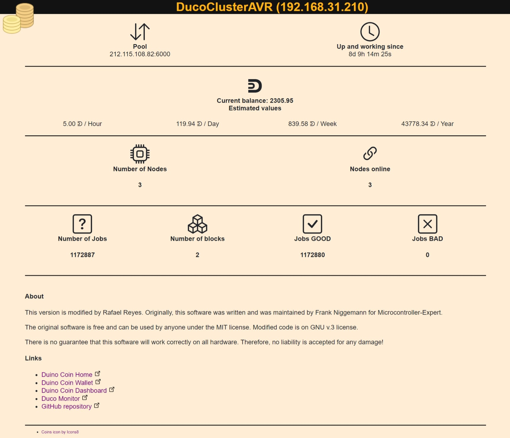

# DucoCluster
This is my personal work about Duino Coin. DucoCluster is divided in two projects to implement the way I have the cluster minig.

The code is based in the official Duino-Coin (https://duinocoin.com/) of ESP8266s boards
(NodeMCU, Wemos, etc.) (https://github.com/revoxhere/duino-coin/tree/master/ESP8266_Code) and duino-coin-rig project on GitHub (https://github.com/MicrocontrollerExpert/duino-coin-rig)

This is DucoClusterAVR 
## Table of contents
- [Hardware](#hardware)
  * [Currently supported hardware](#currently-supported-hardware)
    + [ESP8266](#esp8266)
    + [Arduino Pro Mini clone (ATmega328p)](#arduino-pro-mini-clone-atmega328p)
    + [Green LGT8F328P](#green-lgt8f328p)
- [Component wiring](#component-wiring)
  * [ESP8266 to Avr,s](#esp8266-to-avrs)
- [Required Libraries](#required-libraries)
- [Configuration](#configuration)

## Screenshot Webfrontend



## Hardware
### Currently supported hardware
- Wemos@ D1 Esp-Wroom-02 Motherboard ESP8266 Mini-WIFI NodeMCU + 18650 Battery + 0,96 ssd1306 OLED
- Arduino Pro Mini clone (ATmega328p) / Green LGT8F328P

### ESP8266
The design concept is derived from the open source project NodeMCU. The development board integrates 18650 charge and discharge system, with its own charge and discharge protection, and integrates an OLED and five-way button for easy development.

The display is connected directly to the ESP8266 because no logic level converter is required. SDA and SCL are connected to D1 and D2 respectively. ```Note that the configuration of SDA and SCL are inverted compared to the usually known configuration.```

| Type | ESP8266 Wemos@ D1 |  ESP8266 NodeMCU | SSD1306 |
|:-----:| :-----: | :-----: | :-----: |
| GND | GND | GND | GND |
| Voltage    | 3.3V | 3.3V | VCC |
| SCL | D2 | D1 | SCL |
| SDA | D1 | D2 | SDA |


### Arduino Pro Mini clone (ATmega328p)

### Green LGT8F328P

## Component wiring

### ESP8266 to Avr,s
Tested with Wemos@ D1 ESP8266, but should theoretically work with ESP8266 NodeMCU or similar as well.

Because the ESP8266 works with a 3.3V signal and the Arduino Pro Mini andLGT8F328P need a 5V signal, you have to connect a logic level converter in between. This converts the 3.3V signals from the ESP8266 to 5V for the Avr,s and the 5V signals from the Avr,s to 3.3V for the ESP8266. Without this conversion, the components could not communicate with each other.

| Type | ESP8266 Wemos@ D1 | - | Logic Level Converter | - | Arduino Nano |
|:-----:| :-----: | :-----: | :-----: | :-----: | :-----: | :-----: |
| GND | GND | - | GND - GND | - | GND |
| Voltage    | 3.3V | - | 3V - 5V | - | 5V |
| Voltage    | 5V | - | - | - | 5V |
| SCL | D2 | - | LV1 - HV1 | - | A5 |
| SDA | D1 | - | LV2 - HV2 | - | A4 |


## Required Libraries
You need these libraries to be able to compile the code.

- Arduino
- ArduinoJson @ 6.19.4
- NTPClient @ 3.2.1
- ESP8266 and ESP32 OLED driver for SSD1306 displays @ 4.3.0
- ESP8266HTTPClient @ 1.2
- ESP8266WiFi @ 1.0
- ESP8266mDNS @ 1.2
- ESP8266WebServer @ 1.0
- LittleFS @ 0.1.0
- Wire @ 1.0

## Configuration
You have to configure the variables above in the code. To do this, you need to adjust the following  values in the ```ESP8266_PersonalConfig.hpp``` file.

| Variable | Description |
|:-----:| :-----: |
| wifiSsid | The SSID (name) of your WiFi network |
| wifiPassword | The password of your WiFi network |
| nameUser | The name you use for your wallet |
